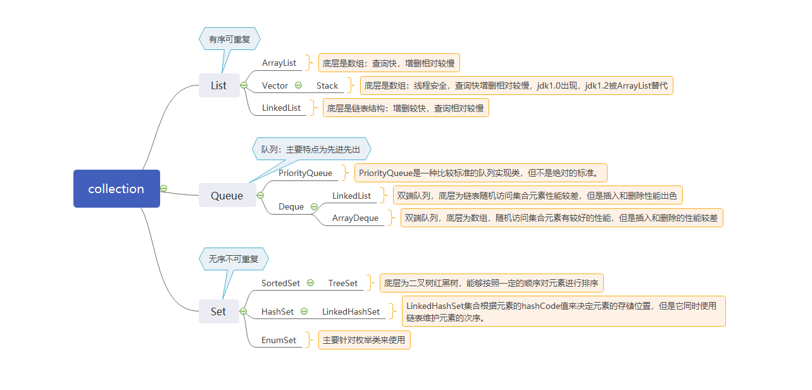
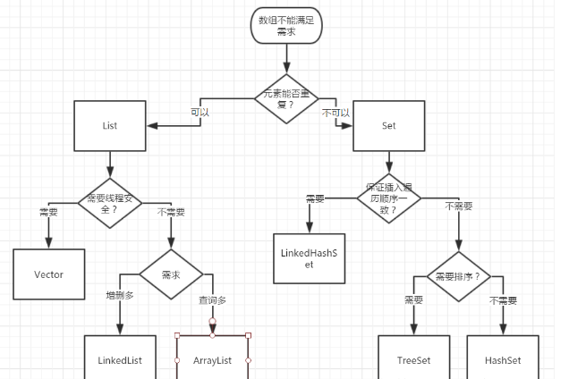

#                                          集合

#### **1.** 集合简介

​     集合是java存储、提取、操作数据的一种常用的方式，集合都是在java.util包中。Java集合类主要由两个接口派生出来：Collection和Map。Collection和Map是Java集合框架的根接口，这两个接口又包含了一些子接口或实现类。

依赖关系如图所示
 
下图为Collection集合体系思维导图

1.List集合

       （1）List集合的特点 ：有序的（插入的顺序和读取的顺序是一致的）
            允许有重复的元素
       （2）List的常用类 ：  
       
                             ArrayList
                             优点: 底层数据结构是数组，查询快，增删慢。
                             缺点: 线程不安全，效率高
                             Vector
                             优点: 底层数据结构是数组，查询快，增删慢。
                             缺点: 线程安全，效率低
                             LinkedList
                             优点: 底层数据结构是链表，查询慢，增删快。
                             缺点: 线程不安全，效率高
 2.Queue队列   
            队列是一种特殊的线性表，它只允许在表的前端（front）进行删除操作，而在表的后端（rear）进行插入操作。进行插入操作的端称为队尾，进行删除操作的端称为队头。队列中没有元素时，称为空队列。 
            在队列这种数据结构中，最先插入的元素将是最先被删除的元素；反之最后插入的元素将是最后被删除的元素，因此队列又称为“先进先出”（FIFO—first in first out）的线性表        
            Queue接口中定义了如下的几个方法：   
            
            void add(Object e):　　将指定元素插入到队列的尾部。
            object element():　　获取队列头部的元素，但是不删除该元素。
            boolean offer(Object e):　　将指定的元素插入此队列的尾部。当使用容量有限的队列时，此方法通常比add(Object e)有效。　
            Object peek():　　返回队列头部的元素，但是不删除该元素。如果队列为空，则返回null。
            Object poll():　　返回队列头部的元素，并删除该元素。如果队列为空，则返回null。
            Object remove():　　获取队列头部的元素，并删除该元素。   
                   
Queue接口有一个PriorityQueue实现类。除此之外，Queue还有一个Deque接口，Deque代表一个“双端队列”，双端队列可以同时从两端删除或添加元素，因此Deque可以当作栈来使用。java为Deque提供了ArrayDeque实现类和LinkedList实现类

     PriorityQueue实现类
            PriorityQueue是一种比较标准的队列实现类，而不是绝对标准的。这是因为PriorityQueue保存队列元素的顺序不是按照元素添加的顺序来保存的，而是在添加元素的时候对元素的大小排序后再保存的。因此在PriorityQueue中使用peek()或pool()取出队列中头部的元素，取出的不是最先添加的元素，而是最小的元素。
            PriorityQueue不允许插入null元素，它还需要对队列元素进行排序，PriorityQueue有两种排序方式：
            自然排序：采用自然排序的PriorityQueue集合中的元素必须实现Comparator接口，而且应该是一个类的多个实例，否则可能导致ClassCastException异常。
            定制排序：创建PriorityQueue队列时，传入一个Comparable对象，该对象负责对所有队列中的所有元素进行排序。采用定制排序不要求必须实现Comparator接口
      Dueue接口与ArrayDeque实现类
            常用方法
            void addFirst(Object e): 　　将指定元素添加到双端队列的头部。
            void addLast(Object e):　　将指定元素添加到双端队列的尾部。
            Object getFirst():　　获取但不删除双端队列的第一个元素。
            Object getLast():　　获取但不删除双端队列的最后一个元素。
            boolean offFirst(Object e):　　将指定元素添加到双端队列的头部。
            boolean offLast(Object e):　　将指定元素添加到双端队列的尾部。
            Object peekFirst():　　获取但不删除双端队列的第一个元素；如果双端队列为空，则返回null。
            Object PeekLast():　　获取但不删除双端队列的最后一个元素；如果双端队列为空，则返回null。
            Object pollFirst():　　获取并删除双端队列的第一个元素；如果双端队列为空，则返回null。
            Object pollLast():　　获取并删除双端队列的最后一个元素；如果双端队列为空，则返回null。
3.Set集合

     HashSet
         底层数据结构是哈希表。(无序,唯一)
         通hashCode()和equals()过来保证元素唯一性
     LinkedHashSet
         底层数据结构是链表和哈希表。(FIFO插入有序,唯一)
         由链表保证元素有序
         由哈希表保证元素唯一
     TreeSet
         底层数据结构是红黑树。(唯一，有序)
         通过自然排序和比较器排序保证元素排序的
         根据compareTo（）比较的返回值是否是0来决定保证元素唯一性   
4.Map集合

    HashMap ：1.8之前数组+单链表，1.8及之后数组+链表+红黑树（B-tree）
    LinkedHashMap ：底层使用哈希表与双向链表来保存所有元素，它维护着一个运行于所有条目的双向链表，此链表定义了迭代顺序，该迭代顺序可以是插入顺序或者是访问顺序。TreeMap  底层红黑树的结构，TreeMap中判断两个key相等的标准是： 
                    两个key通过compareTo()方法的返回值为0.（在自然排序下） 
                    两个key通过compareTo()方法的返回值为0.同时equals()方法比较返回为true。（定制排序下）。
    HashTable和HashMap的区别： 
                   （1）HashTable线程安全的，HashMap线程不安全
                   （2）HashTable的key不能为null，HashMap的key可以为null
5.使用场景
  
